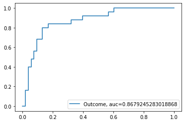

# Project 1

Use the data *diabetes2.csv* for this project. More information about the dataset can be found here: https://www.kaggle.com/kandij/diabetes-dataset

## Linear Regression

Can you predict BMI based on other features in the dataset?

1. Explore the Data
2. Build your Model
    - Build a Linear Regression Model using train_test_split() for your cross-validation
    - Standardize your continuous predictors
3. Evaluate your model
    - How did your model do? What metrics do you use to support this?
4. Interpret the coefficients to your model
    - In the context of this problem, what do the coefficients represent?
  


```python
import warnings
warnings.filterwarnings('ignore')

import pandas as pd
import numpy as np

import matplotlib.pyplot as plt
from plotnine import *
import seaborn as sns

from sklearn.linear_model import LinearRegression, LogisticRegression # Linear Regression Model
from sklearn.preprocessing import StandardScaler, LabelBinarizer 
from sklearn.metrics import accuracy_score, precision_score, recall_score, confusion_matrix, roc_curve,mean_squared_error, r2_score, roc_auc_score #model eval
from sklearn.model_selection import train_test_split # simple TT split cv
from sklearn.model_selection import KFold # k-fold cv
#from sklearn.model_selection import LeaveOneOut #LOO cv
from sklearn.model_selection import cross_val_score # cross validation metrics
from sklearn.model_selection import cross_val_predict # cross validation metrics

get_ipython().run_line_magic('matplotlib', 'inline')
```


```python
diabetes = pd.read_csv('data/diabetes2.csv')
print(diabetes.head())
print(diabetes.describe())
print(diabetes.info())
print(diabetes.isnull().sum())
#diabetes.loc[diabetes['SkinThickness'] == 0]
#diabetes.loc[diabetes['Weight'].isnull()]
```

       Pregnancies  Glucose  BloodPressure  SkinThickness  Insulin   BMI  \
    0            6      148             72             35        0  33.6   
    1            1       85             66             29        0  26.6   
    2            8      183             64              0        0  23.3   
    3            1       89             66             23       94  28.1   
    4            0      137             40             35      168  43.1   
    
       DiabetesPedigreeFunction  Age  Outcome  
    0                     0.627   50        1  
    1                     0.351   31        0  
    2                     0.672   32        1  
    3                     0.167   21        0  
    4                     2.288   33        1  
           Pregnancies     Glucose  BloodPressure  SkinThickness     Insulin  \
    count   768.000000  768.000000     768.000000     768.000000  768.000000   
    mean      3.845052  120.894531      69.105469      20.536458   79.799479   
    std       3.369578   31.972618      19.355807      15.952218  115.244002   
    min       0.000000    0.000000       0.000000       0.000000    0.000000   
    25%       1.000000   99.000000      62.000000       0.000000    0.000000   
    50%       3.000000  117.000000      72.000000      23.000000   30.500000   
    75%       6.000000  140.250000      80.000000      32.000000  127.250000   
    max      17.000000  199.000000     122.000000      99.000000  846.000000   
    
                  BMI  DiabetesPedigreeFunction         Age     Outcome  
    count  768.000000                768.000000  768.000000  768.000000  
    mean    31.992578                  0.471876   33.240885    0.348958  
    std      7.884160                  0.331329   11.760232    0.476951  
    min      0.000000                  0.078000   21.000000    0.000000  
    25%     27.300000                  0.243750   24.000000    0.000000  
    50%     32.000000                  0.372500   29.000000    0.000000  
    75%     36.600000                  0.626250   41.000000    1.000000  
    max     67.100000                  2.420000   81.000000    1.000000  
    <class 'pandas.core.frame.DataFrame'>
    RangeIndex: 768 entries, 0 to 767
    Data columns (total 9 columns):
    Pregnancies                 768 non-null int64
    Glucose                     768 non-null int64
    BloodPressure               768 non-null int64
    SkinThickness               768 non-null int64
    Insulin                     768 non-null int64
    BMI                         768 non-null float64
    DiabetesPedigreeFunction    768 non-null float64
    Age                         768 non-null int64
    Outcome                     768 non-null int64
    dtypes: float64(2), int64(7)
    memory usage: 54.1 KB
    None
    Pregnancies                 0
    Glucose                     0
    BloodPressure               0
    SkinThickness               0
    Insulin                     0
    BMI                         0
    DiabetesPedigreeFunction    0
    Age                         0
    Outcome                     0
    dtype: int64
    

Removing 0 values to improve model metrics


```python
diabetes = diabetes[diabetes.BloodPressure != 0] #removed 0 values to avoid throwing off the model
diabetes = diabetes[diabetes.SkinThickness != 0]
diabetes = diabetes[diabetes.Insulin != 0]
diabetes = diabetes[diabetes.BMI != 0]
diabetes = diabetes[diabetes.Glucose != 0]

diabetes = diabetes.reset_index(drop = True)
print(diabetes.shape)
print(diabetes.describe())
```

    (392, 9)
           Pregnancies     Glucose  BloodPressure  SkinThickness     Insulin  \
    count   392.000000  392.000000     392.000000     392.000000  392.000000   
    mean      3.301020  122.627551      70.663265      29.145408  156.056122   
    std       3.211424   30.860781      12.496092      10.516424  118.841690   
    min       0.000000   56.000000      24.000000       7.000000   14.000000   
    25%       1.000000   99.000000      62.000000      21.000000   76.750000   
    50%       2.000000  119.000000      70.000000      29.000000  125.500000   
    75%       5.000000  143.000000      78.000000      37.000000  190.000000   
    max      17.000000  198.000000     110.000000      63.000000  846.000000   
    
                  BMI  DiabetesPedigreeFunction         Age     Outcome  
    count  392.000000                392.000000  392.000000  392.000000  
    mean    33.086224                  0.523046   30.864796    0.331633  
    std      7.027659                  0.345488   10.200777    0.471401  
    min     18.200000                  0.085000   21.000000    0.000000  
    25%     28.400000                  0.269750   23.000000    0.000000  
    50%     33.200000                  0.449500   27.000000    0.000000  
    75%     37.100000                  0.687000   36.000000    1.000000  
    max     67.100000                  2.420000   81.000000    1.000000  
    


```python
#g = sns.pairplot(diabetes)
```


```python
diabetes.loc[diabetes['BMI'] < 18.5, 'Weight'] = 'Underweight'
diabetes.loc[diabetes['BMI'].between(18.5,24.999), 'Weight'] = 'Normal'
diabetes.loc[diabetes['BMI'].between(25,29.999), 'Weight'] = 'Overweight'
diabetes.loc[diabetes['BMI'] >= 30, 'Weight'] = 'Obese'

diabetes["Weight"] = diabetes["Weight"].astype('category')

label_binary = LabelBinarizer()
lb_results = label_binary.fit_transform(diabetes["Weight"])
column_names = label_binary.classes_
# lb_results.shape
# column_names

lb_df = pd.DataFrame(lb_results, columns = column_names)
#print(lb_df)

diabetes = diabetes.join(lb_df, lsuffix='index', rsuffix='index')

diabetes.head(20)


# diabetes["Weight_cat"] = diabetes["Weight"].cat.codes

# print(diabetes.describe(include = "all"))
# diabetes.head(20)
```


<div>
<style scoped>
    .dataframe tbody tr th:only-of-type {
        vertical-align: middle;
    }

    .dataframe tbody tr th {
        vertical-align: top;
    }

    .dataframe thead th {
        text-align: right;
    }
</style>
<table border="1" class="dataframe">
  <thead>
    <tr style="text-align: right;">
      <th></th>
      <th>Pregnancies</th>
      <th>Glucose</th>
      <th>BloodPressure</th>
      <th>SkinThickness</th>
      <th>Insulin</th>
      <th>BMI</th>
      <th>DiabetesPedigreeFunction</th>
      <th>Age</th>
      <th>Outcome</th>
      <th>Weight</th>
      <th>Normal</th>
      <th>Obese</th>
      <th>Overweight</th>
      <th>Underweight</th>
    </tr>
  </thead>
  <tbody>
    <tr>
      <td>0</td>
      <td>1</td>
      <td>89</td>
      <td>66</td>
      <td>23</td>
      <td>94</td>
      <td>28.1</td>
      <td>0.167</td>
      <td>21</td>
      <td>0</td>
      <td>Overweight</td>
      <td>0</td>
      <td>0</td>
      <td>1</td>
      <td>0</td>
    </tr>
    <tr>
      <td>1</td>
      <td>0</td>
      <td>137</td>
      <td>40</td>
      <td>35</td>
      <td>168</td>
      <td>43.1</td>
      <td>2.288</td>
      <td>33</td>
      <td>1</td>
      <td>Obese</td>
      <td>0</td>
      <td>1</td>
      <td>0</td>
      <td>0</td>
    </tr>
    <tr>
      <td>2</td>
      <td>3</td>
      <td>78</td>
      <td>50</td>
      <td>32</td>
      <td>88</td>
      <td>31.0</td>
      <td>0.248</td>
      <td>26</td>
      <td>1</td>
      <td>Obese</td>
      <td>0</td>
      <td>1</td>
      <td>0</td>
      <td>0</td>
    </tr>
    <tr>
      <td>3</td>
      <td>2</td>
      <td>197</td>
      <td>70</td>
      <td>45</td>
      <td>543</td>
      <td>30.5</td>
      <td>0.158</td>
      <td>53</td>
      <td>1</td>
      <td>Obese</td>
      <td>0</td>
      <td>1</td>
      <td>0</td>
      <td>0</td>
    </tr>
    <tr>
      <td>4</td>
      <td>1</td>
      <td>189</td>
      <td>60</td>
      <td>23</td>
      <td>846</td>
      <td>30.1</td>
      <td>0.398</td>
      <td>59</td>
      <td>1</td>
      <td>Obese</td>
      <td>0</td>
      <td>1</td>
      <td>0</td>
      <td>0</td>
    </tr>
    <tr>
      <td>5</td>
      <td>5</td>
      <td>166</td>
      <td>72</td>
      <td>19</td>
      <td>175</td>
      <td>25.8</td>
      <td>0.587</td>
      <td>51</td>
      <td>1</td>
      <td>Overweight</td>
      <td>0</td>
      <td>0</td>
      <td>1</td>
      <td>0</td>
    </tr>
    <tr>
      <td>6</td>
      <td>0</td>
      <td>118</td>
      <td>84</td>
      <td>47</td>
      <td>230</td>
      <td>45.8</td>
      <td>0.551</td>
      <td>31</td>
      <td>1</td>
      <td>Obese</td>
      <td>0</td>
      <td>1</td>
      <td>0</td>
      <td>0</td>
    </tr>
    <tr>
      <td>7</td>
      <td>1</td>
      <td>103</td>
      <td>30</td>
      <td>38</td>
      <td>83</td>
      <td>43.3</td>
      <td>0.183</td>
      <td>33</td>
      <td>0</td>
      <td>Obese</td>
      <td>0</td>
      <td>1</td>
      <td>0</td>
      <td>0</td>
    </tr>
    <tr>
      <td>8</td>
      <td>1</td>
      <td>115</td>
      <td>70</td>
      <td>30</td>
      <td>96</td>
      <td>34.6</td>
      <td>0.529</td>
      <td>32</td>
      <td>1</td>
      <td>Obese</td>
      <td>0</td>
      <td>1</td>
      <td>0</td>
      <td>0</td>
    </tr>
    <tr>
      <td>9</td>
      <td>3</td>
      <td>126</td>
      <td>88</td>
      <td>41</td>
      <td>235</td>
      <td>39.3</td>
      <td>0.704</td>
      <td>27</td>
      <td>0</td>
      <td>Obese</td>
      <td>0</td>
      <td>1</td>
      <td>0</td>
      <td>0</td>
    </tr>
    <tr>
      <td>10</td>
      <td>11</td>
      <td>143</td>
      <td>94</td>
      <td>33</td>
      <td>146</td>
      <td>36.6</td>
      <td>0.254</td>
      <td>51</td>
      <td>1</td>
      <td>Obese</td>
      <td>0</td>
      <td>1</td>
      <td>0</td>
      <td>0</td>
    </tr>
    <tr>
      <td>11</td>
      <td>10</td>
      <td>125</td>
      <td>70</td>
      <td>26</td>
      <td>115</td>
      <td>31.1</td>
      <td>0.205</td>
      <td>41</td>
      <td>1</td>
      <td>Obese</td>
      <td>0</td>
      <td>1</td>
      <td>0</td>
      <td>0</td>
    </tr>
    <tr>
      <td>12</td>
      <td>1</td>
      <td>97</td>
      <td>66</td>
      <td>15</td>
      <td>140</td>
      <td>23.2</td>
      <td>0.487</td>
      <td>22</td>
      <td>0</td>
      <td>Normal</td>
      <td>1</td>
      <td>0</td>
      <td>0</td>
      <td>0</td>
    </tr>
    <tr>
      <td>13</td>
      <td>13</td>
      <td>145</td>
      <td>82</td>
      <td>19</td>
      <td>110</td>
      <td>22.2</td>
      <td>0.245</td>
      <td>57</td>
      <td>0</td>
      <td>Normal</td>
      <td>1</td>
      <td>0</td>
      <td>0</td>
      <td>0</td>
    </tr>
    <tr>
      <td>14</td>
      <td>3</td>
      <td>158</td>
      <td>76</td>
      <td>36</td>
      <td>245</td>
      <td>31.6</td>
      <td>0.851</td>
      <td>28</td>
      <td>1</td>
      <td>Obese</td>
      <td>0</td>
      <td>1</td>
      <td>0</td>
      <td>0</td>
    </tr>
    <tr>
      <td>15</td>
      <td>3</td>
      <td>88</td>
      <td>58</td>
      <td>11</td>
      <td>54</td>
      <td>24.8</td>
      <td>0.267</td>
      <td>22</td>
      <td>0</td>
      <td>Normal</td>
      <td>1</td>
      <td>0</td>
      <td>0</td>
      <td>0</td>
    </tr>
    <tr>
      <td>16</td>
      <td>4</td>
      <td>103</td>
      <td>60</td>
      <td>33</td>
      <td>192</td>
      <td>24.0</td>
      <td>0.966</td>
      <td>33</td>
      <td>0</td>
      <td>Normal</td>
      <td>1</td>
      <td>0</td>
      <td>0</td>
      <td>0</td>
    </tr>
    <tr>
      <td>17</td>
      <td>4</td>
      <td>111</td>
      <td>72</td>
      <td>47</td>
      <td>207</td>
      <td>37.1</td>
      <td>1.390</td>
      <td>56</td>
      <td>1</td>
      <td>Obese</td>
      <td>0</td>
      <td>1</td>
      <td>0</td>
      <td>0</td>
    </tr>
    <tr>
      <td>18</td>
      <td>3</td>
      <td>180</td>
      <td>64</td>
      <td>25</td>
      <td>70</td>
      <td>34.0</td>
      <td>0.271</td>
      <td>26</td>
      <td>0</td>
      <td>Obese</td>
      <td>0</td>
      <td>1</td>
      <td>0</td>
      <td>0</td>
    </tr>
    <tr>
      <td>19</td>
      <td>9</td>
      <td>171</td>
      <td>110</td>
      <td>24</td>
      <td>240</td>
      <td>45.4</td>
      <td>0.721</td>
      <td>54</td>
      <td>1</td>
      <td>Obese</td>
      <td>0</td>
      <td>1</td>
      <td>0</td>
      <td>0</td>
    </tr>
  </tbody>
</table>
</div>


```python
g = sns.scatterplot(data = diabetes,x = 'Age', y = 'BMI',
                   sizes=(20, 200), hue_norm=(0, 7), legend = False)
```


Seems like age doesnt play too much of a factor on BMI. I figured there would be lower BMI's in older women


```python
g = sns.scatterplot(data = diabetes,x = 'BloodPressure', y = 'BMI',
                   sizes=(20, 200), hue_norm=(0, 7), legend = False)
```


It seems like there are many women of with both above average (31) BMI and above average blood pressure (69) 


```python
corr = diabetes.corr()
sns.heatmap(corr,xticklabels=corr.columns, yticklabels=corr.columns)
```


    <matplotlib.axes._subplots.AxesSubplot at 0x1cbcde7d988>


Correlation matrix shows strong relationships between a few variables. The darker the color the more negative a relationship and the lighter means the more positive relationship. Examples of negative relationships are highlighed in the Normal weight range. Notice how nearly all squares are dark indicating that a normal weight range has a negative relationship with nearly all other variables. The opposite can be seen in the obese weight range where colors are lighter and signify a positive relationship between obesity and variables such as glucose and insulin.


```python
predictors = ['Pregnancies', 'Glucose', 'BloodPressure', 'SkinThickness', 'Insulin', 'DiabetesPedigreeFunction', 'Age', 'Outcome']
```


```python
X_train, X_test, y_train, y_test = train_test_split(diabetes[predictors], diabetes["BMI"], test_size=0.2)
```


```python
zscore = StandardScaler()
zscore.fit(X_train)
Xz_train = zscore.transform(X_train)
Xz_test = zscore.transform(X_test)
```


```python
model = LinearRegression()
model.fit(X_train, y_train)
```


    LinearRegression(copy_X=True, fit_intercept=True, n_jobs=None, normalize=False)


```python
train_pred = model.predict(X_train)
test_pred = model.predict(X_test)
```


```python
print('training r2 is:', model.score(X_train, y_train)) #training R2
print('testing r2 is:', model.score(X_test, y_test)) #testing R2

print('\ntrain mse is: ', mean_squared_error(y_train,train_pred))
print('test mse is: ', mean_squared_error(y_test,test_pred))
```

    training r2 is: 0.5110376027308636
    testing r2 is: 0.45045548584951967
    
    train mse is:  24.921856244482562
    test mse is:  23.25531849828658
    


```python
coefficients = pd.DataFrame({"Coef":model.coef_,
              "Name": predictors})

coefficients = coefficients.append({"Coef": model.intercept_,
               "Name": "intercept"}, ignore_index = True)

coefficients
```


<div>
<style scoped>
    .dataframe tbody tr th:only-of-type {
        vertical-align: middle;
    }

    .dataframe tbody tr th {
        vertical-align: top;
    }

    .dataframe thead th {
        text-align: right;
    }
</style>
<table border="1" class="dataframe">
  <thead>
    <tr style="text-align: right;">
      <th></th>
      <th>Coef</th>
      <th>Name</th>
    </tr>
  </thead>
  <tbody>
    <tr>
      <td>0</td>
      <td>-0.172751</td>
      <td>Pregnancies</td>
    </tr>
    <tr>
      <td>1</td>
      <td>-0.007750</td>
      <td>Glucose</td>
    </tr>
    <tr>
      <td>2</td>
      <td>0.106797</td>
      <td>BloodPressure</td>
    </tr>
    <tr>
      <td>3</td>
      <td>0.400753</td>
      <td>SkinThickness</td>
    </tr>
    <tr>
      <td>4</td>
      <td>0.006368</td>
      <td>Insulin</td>
    </tr>
    <tr>
      <td>5</td>
      <td>0.722948</td>
      <td>DiabetesPedigreeFunction</td>
    </tr>
    <tr>
      <td>6</td>
      <td>-0.069595</td>
      <td>Age</td>
    </tr>
    <tr>
      <td>7</td>
      <td>1.932546</td>
      <td>Outcome</td>
    </tr>
    <tr>
      <td>8</td>
      <td>15.653319</td>
      <td>intercept</td>
    </tr>
  </tbody>
</table>
</div>


How did your model do? What metrics do you use to support this?
<br/>
<br/>
The model did well given decent r-squared scores in both training and testing sets. MSE in both training and test set are within one point of each other signifying a good fit. A way to improve this model might be to include a better cross validation method as well as getting more data.
<br/>


```python

```

In the context of this problem, what do the coefficients represent?
<br/>
<br/>
The coefficients represent the value that BMI increases or decreases for every one standard deviation for its corresponding variable. For example, for every one standard deviation in pregnancy a woman is, her BMI is predicted to go down by her number of pregnancies multiplied by -.17. The strongest predictor in our model is whether the person is diabetic or not, if a woman were to be diabetic, our model adds 1.93 to her predicted BMI. Second highest variable is the diabetes pedigree funtion meaning that family history plays a large role in a womans BMI.
<br/>

## Logistic Regression

Can you predict Diabetes (Outcome) based on other features in the dataset?

1. Explore the Data (if using different variables from Linear Regression)
2. Build your Model
    - Build a Logistic Regression Model using cross-validation
       - What cross-val method did you choose, why?
    - Standardize your continuous predictors
3. Evaluate your model
    - How did your model do? What metrics do you use to support this?
  


```python
yes = diabetes[diabetes['Outcome'] == 1]
no = diabetes[diabetes['Outcome'] == 0]
```


```python
(ggplot()
+geom_point(yes, aes(x = 'BloodPressure' ,y = 'Insulin'), color = 'red')
+geom_point(no, aes(x = 'BloodPressure' ,y = 'Insulin'), color = 'green'))
```


    <ggplot: (-9223371913426926004)>


```python
(ggplot()
+geom_bar(yes, aes(x = 'DiabetesPedigreeFunction'), color = 'red')
+geom_bar(no, aes(x = 'DiabetesPedigreeFunction'), color = 'green'))
```


    <ggplot: (-9223371913425881564)>


```python
predictors = ['Normal','Pregnancies', 'BMI', 'BloodPressure', 'SkinThickness', 'Glucose', 'Insulin', 'DiabetesPedigreeFunction', 'Age']
X = diabetes[predictors]
y = diabetes["Outcome"]
X_train, X_test, y_train, y_test = train_test_split(X, y, test_size=0.2)
```


```python
# create k-fold object
kf = KFold(n_splits = 5)
kf.split(X)


lr = LogisticRegression() 

acc = [] #create empty list to store accuracy for each fold
predictedVals = []
```


```python
#print(diabetes.isnull().sum())
#print(diabetes.isna().sum())
#diabetes.replace([np.inf, -np.inf], np.nan).dropna(axis=1)
```


```python
for train_indices, test_indices in kf.split(X):
    # Get your train/test for this fold
    y=y.reset_index(drop=True)
    X_train = X.iloc[train_indices] #iloc used to find col index
    X_test  = X.iloc[test_indices]
    y_train = y[train_indices]
    y_test  = y[test_indices]
    
    #standardize
    zscore = StandardScaler()
    zscore.fit(X_train)
    
    Xs_train = zscore.transform(X_train)
    Xs_test = zscore.transform(X_test)
    
    # model
    model = lr.fit(Xs_train, y_train)
    # record accuracy and predictions
    
    acc.append(accuracy_score(y_test, model.predict(Xs_test)))
    
print(acc)
np.mean(acc)
```

    0
    0
    0
    0
    0
    [0.8481012658227848, 0.620253164556962, 0.8205128205128205, 0.8461538461538461, 0.8333333333333334]
    


    0.7936708860759494


What cross-val method did you choose, why?
<br/>
<br/>
I chose a k-fold validation method with 5 folds because k-fold reduces bias when constructing a model and limits the variance our model is exposed to in training.
<br/>


```python
predictedVals = model.predict(Xs_test) #predic
accuracy_score(y_test,predictedVals)
```


    0.8333333333333334


```python
cnf_matrix = confusion_matrix(y_test, predictedVals)
cnf_matrix
```


    array([[48,  5],
           [ 8, 17]], dtype=int64)


```python
class_names=[0,1]
fig, ax = plt.subplots()
tick_marks = np.arange(len(class_names))
plt.xticks(tick_marks, class_names)
plt.yticks(tick_marks, class_names)

# create heatmap

sns.heatmap(pd.DataFrame(cnf_matrix), annot=False, cmap="Blues")
ax.xaxis.set_label_position("top")
plt.tight_layout()
plt.title('Confusion matrix', y=1.1)
plt.ylabel('Actual label')
plt.xlabel('Predicted label')
```


    Text(0.5, 257.44, 'Predicted label')


```python
print("Accuracy - TP+TN/TP+FP+FN+TN:",accuracy_score(y_test, predictedVals))
print("Precision - TP/TP+FP:",precision_score(y_test, predictedVals)) #relates to low false positivity
print("Recall/Sensitivity/TPR - TP/TP+FN:",recall_score(y_test, predictedVals))
```

    Accuracy - TP+TN/TP+FP+FN+TN: 0.8333333333333334
    Precision - TP/TP+FP: 0.7727272727272727
    Recall/Sensitivity/TPR - TP/TP+FN: 0.68
    


```python
y_pred_proba = model.predict_proba(Xs_test)[::,1]
fpr, tpr, _ = roc_curve(y_test,  y_pred_proba)
auc = roc_auc_score(y_test, y_pred_proba)
plt.plot(fpr,tpr,label="Outcome, auc="+str(auc))
plt.legend(loc=4)
plt.show()
```





How did your model do? What metrics do you use to support this?
<br/>
<br/>
The model did well accurately predicting 83% of our test data and having an auc score of 87%. However our models true positive rate is 68% meaning that 32% percent of women would be given a false negative report when they actually do have diabetes. 
<br/>


```python
coeff = list(model.coef_[0])
labels = list(X_test.columns)
features = pd.DataFrame()
features['Features'] = labels
features['importance'] = coeff
features.sort_values(by=['importance'], ascending=True, inplace=True)
features['positive'] = features['importance'] > 0
features.set_index('Features', inplace=True)
features.importance.plot(kind='barh', figsize=(11, 6),color = features.positive.map({True: 'blue', False: 'red'}))
plt.xlabel('Importance')
```


    Text(0.5, 0, 'Importance')


## Data Viz

Based on your new understanding of the data create 2 graphs using ggplot/plotnine. These should **not** be graphs you made in the Explore phase of either the Logistic or Linear Regression portion.

Make sure you include at **least** 3 out of these 5 elements in your at least one of your graphs:

1. Custom x-axis labels, y-axis labels and titles
2. Fill and/or Color by a variable
3. Use facet_wrap()
4. Layer multiple geoms
5. Change the theme of your graph (see: https://plotnine.readthedocs.io/en/stable/generated/plotnine.themes.theme.html)


```python
diabetes['count'] = 1

(ggplot(diabetes,aes(x = 'Outcome', y = 'count', fill = 'Outcome')) #fill
+geom_bar(stat = 'identity')
+facet_wrap('~Weight') #facet wrap
+theme_minimal()) #theme
```


    <ggplot: (-9223371913425484496)>


```python
(ggplot(diabetes,aes(x = 'Outcome', y = 'Glucose', fill = 'Outcome')) #fill
+geom_bar(stat = 'identity')
+facet_wrap('~Weight') #facet wrap
+theme_minimal()) #theme
```


    <ggplot: (-9223371913425824696)>


```python

```
